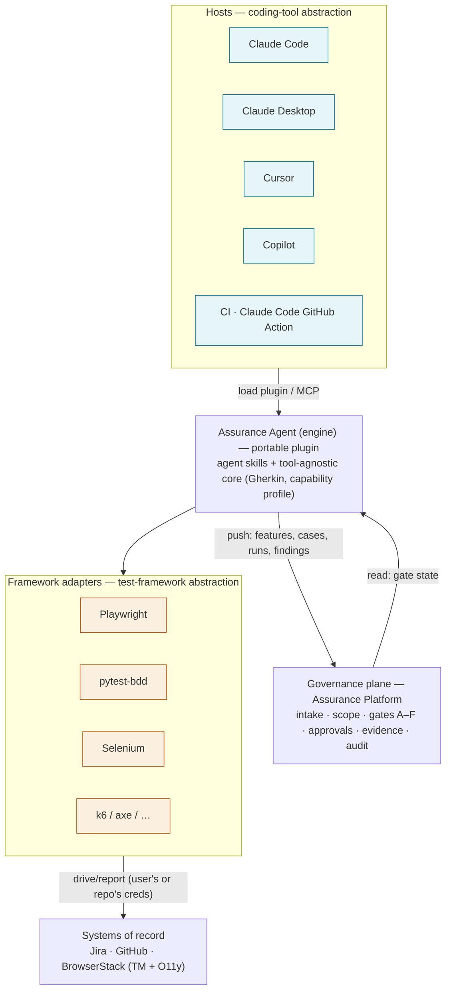

# Assurance Line — end-to-end architecture

**Purpose.** Work out *how this actually runs*, end to end, and settle the questions that the walkthrough
was glossing: what "Connect Application" really does, where the work happens (Claude Code + MCP vs. the
web app), how results show up in the platform, and how we avoid lock-in while keeping one governance model.

**The one-sentence thesis.** Separate *how tests get made and run* (pluggable — any coding tool, any test
framework, laptop or CI) from *how quality is governed* (one consistent control plane). Everything below
follows from that split.

---

## 1. Two planes

| | **Execution plane** | **Governance plane** |
|---|---|---|
| What | Makes and runs the tests; touches the real systems | Decides, records, and shows — the control plane |
| Where | A dev/QA laptop, or a CI runner | The Assurance Platform (shared web app + DB) |
| Who/what | An agentic host (Claude Code, Cursor, …) running the **Assurance plugin**, or the CI action | Sofia/Sunil/Bharath in a browser; the platform's own logic |
| Talks to | Jira · GitHub · BrowserStack — **with the user's / repo's own credentials** | Only its own database; **never calls Jira/GitHub/BrowserStack** |
| Lock-in | None — swap the host or the framework freely | N/A — one platform, stable contract |

The execution plane is deliberately open on two axes (host, framework). The governance plane is deliberately
singular. They meet at a thin **push/read contract** (§4).

---

## 2. The layers (the picture)

```
   ┌──────────────────────────────────────────────────────────────────────────────┐
   │  HOSTS  —  coding-tool abstraction  (pick any; the plugin is the same)         │
   │  Claude Code · Claude Desktop · Cursor · GitHub Copilot · CI (Claude Code       │
   │  GitHub Action) · [later: the Assurance web-app's own agent runtime]           │
   └───────────────────────────────┬──────────────────────────────────────────────┘
                                    │ load the plugin · speak MCP
                                    ▼
   ┌───────────────────────────────────────────────┐   push events ──▶  ┌──────────────────────────┐
   │  ASSURANCE AGENT   (engine · portable plugin)  │                    │  GOVERNANCE PLANE         │
   │  agent skills:  /assure-context · author       │                    │  Assurance Platform       │
   │    · automate · heal · pipeline · flaky        │ ◀── read gate ──   │  intake · scope           │
   │  tool-agnostic core:  consolidated context ·   │      state         │  gates A–F · approvals    │
   │    ISTQB Gherkin · the capability profile      │                    │  evidence roll-up · audit │
   └───────────────────────────────┬───────────────┘                    │  portfolio health         │
                                    │ generate for the chosen adapter    └──────────────────────────┘
                                    ▼                                        stores its own state;
   ┌──────────────────────────────────────────────────────────────────┐    calls no vendor APIs
   │  FRAMEWORK ADAPTERS  —  test-framework abstraction  (pick any)     │
   │  Playwright · pytest-bdd · Selenium · boilerplate · Cypress ·      │
   │  k6 (perf) · axe (a11y) …   — one authored intent, swappable exec  │
   └───────────────────────────────┬──────────────────────────────────┘
                                    │ drive / report  (via the host's or the repo's own creds)
                                    ▼
   ┌──────────────────────────────────────────────────────────────────┐
   │  SYSTEMS OF RECORD   Jira · GitHub · BrowserStack (TM + O11y)      │
   │  reached ONLY by the engine/CI with the user's/repo's credentials  │
   └──────────────────────────────────────────────────────────────────┘
```

Two swappable layers (Hosts, Framework adapters); one fixed contract to one governance plane. That is the
whole "no lock-in, consistent governance" claim, drawn.



---

## 3. The Assurance Agent (the engine) as a portable plugin

> **Naming:** the engine is branded **the Assurance Agent** (system level — the agentic, autonomous unit that
> plans, wields MCP tools, loops and self-heals). It is *composed of* **agent skills** (Anthropic's own term for
> `SKILL.md` capabilities) — one `/assure-*` per job. So: an **agent**, built from composable **agent skills**.
> We deliberately do *not* call each individual `/assure-*` "an agent" (that would collide with Claude Code's
> distinct subagent primitive and over-claim autonomy against the human-at-every-gate thesis).

The agent we already built (the `assure-*` **agent skills** + the tool-agnostic contracts + the adapters) is
packaged as **one portable unit** that drops into any agentic host:

- **MCP is the lingua franca.** Every target host — Claude Code, Claude Desktop, Cursor, Copilot — speaks
  MCP. The agent's capabilities are exposed so any of them can drive the flow. The `/assure-*`
  **agent skills / commands** are the Claude-native ergonomic layer bundled alongside (a "plugin" in Claude Code
  terms: agent skills + commands + MCP config + subagents).
- **Host-independent by design.** The engine's logic — consolidate Jira context, author ISTQB Gherkin,
  generate automation, triage/heal, wire CI — does not depend on which host it runs in. The host provides
  the model + the tool-execution loop; the plugin provides the assurance behaviour.
- **Framework-independent by design.** Authoring produces **one** tool-agnostic Gherkin set + a
  **capability profile** (framework, matrix, lane). The profile selects the **adapter** that turns Gherkin
  into runnable tests. We proved this in the prototype by generating *both* Playwright and pytest-bdd from
  one set — that's the abstraction working, not the product default (one framework per app is the default).

**What's reused vs. new:** the agent, agent skills, adapters, and MCP wiring already exist and run green. New is
only (a) packaging them as a versioned, installable plugin and (b) the thin governance contract in §4.

---

## 4. The governance contract (how results "show up in the platform")

This is the crux the walkthrough was hand-waving. **The platform does not connect to Jira, GitHub, or
BrowserStack at all.** Building a second, parallel set of vendor API clients inside the web app would be
duplicate plumbing — the engine already touches those systems with working credentials. So instead:

- **The execution plane pushes; the platform receives.** As the engine does work it already does, it POSTs
  a small event to the platform's API:
  - `/assure-context` reads Jira epics/stories → **pushes the feature list**.
  - `/assure-author` publishes cases to BrowserStack TM → **pushes the authoring/case state**.
  - the `/assure-pipeline` CI workflow runs the matrix + talks to BrowserStack → **pushes a signed run
    summary** (evidence deep-links included).
  - a confirmed failure → **pushes a finding** (with the Jira defect key the engine just created).
- **The platform's only outbound call is a read of its own gate state.** Before a gated step proceeds, the
  engine asks the platform "is Gate B approved?" — a read, not the platform reaching out.
- **The one thing that is genuinely platform-native:** the **approval decisions themselves** (Gates A/B/F).
  Sofia clicks Approve → recorded in the platform's own DB. Nothing else can produce that fact.
- **Writes to systems of record stay in the execution plane.** Filing a Jira defect (Gate E) is done by the
  engine with the QA's own MCP, using the **host's own tool-approval prompt** as the human-in-the-loop
  moment. The platform only reads back a deep link. (Optionally, the engine — not the platform — also writes
  the approval status onto the BrowserStack TM case, with its own creds, so anyone browsing TM sees it.)

**Credentials, therefore:** the user's MCP creds (on a laptop) or the repo's secrets (in CI) do the real
work. The platform holds a scoped API token for the *engine→platform* push only. No vendor OAuth app, no
platform-side Jira/GitHub/BrowserStack keys. This is why "Connect Application" needs no credentials (§5).

---

## 5. "Connect Application" and "Set up Assurance", resolved

Because the platform never calls the vendors, the two setup flows split cleanly by plane:

**Connect Application (governance plane · browser · Sunil, the Assurance Lead).** Pure **metadata
registration** — a directory entry, like a CMDB record: name, team, Jira **project key**, GitHub **repo
slug**, environment **URL**, BrowserStack **project name**. No credentials, no OAuth, no live "test
connection" (the platform has nothing to connect *with*). The entry is **inert until verified by the first
real run** from the execution plane.

**Set up Assurance (execution plane · Claude Code · Bharath, the QA).** This is where real credentials first
touch the systems. In Claude Code (with the Assurance plugin loaded), Bharath runs setup; the plugin, using
**his own Atlassian MCP**, reads the SAA epic, he picks **one framework** (→ the capability profile),
it **scaffolds the one test repo**, and it **pushes the feature list + a "connected" status to the
platform**. *That push* is what makes the features appear in the platform and flips the Application to
Connected — the platform learned it from the engine, not from Jira. (Later, the **Assurance AI Kit**
one-command installer automates this first-run setup; today it's a manual command.)

So the honest sequence is: **register (browser) → set up + first sync (Claude Code) → features live in the
platform.** The walkthrough now reflects exactly this.

---

## 6. Two deployment modes — same engine, same governance

- **Assisted (human at the wheel).** A QA in Claude Code / Cursor / etc. runs `/assure-*` interactively.
  HITL is the host's tool-approval prompts (e.g. "file this Jira defect?") plus the platform gates (B/F).
  This is the demo's mode.
- **Autonomous (CI).** The **Claude Code GitHub Action**, installed in the *application-under-test's repo*,
  runs the same agent (its agent skills/workflows) headlessly on a trigger (PR opened, nightly, or a story moving to Done).
  It authors/updates, runs the matrix, and pushes results to the platform. Risk-bearing transitions still
  gate: within an approved policy it may proceed autonomously; otherwise it opens the gate and waits for a
  human on the platform. Same plugin, same contract, same gates — just no human typing the commands.

The point: assisted and autonomous are the *same engine* in a different host. Governance doesn't change
because the runner did.

---

## 7. Why this is the pitch (say this to the stakeholders)

- **No lock-in, two ways.** Change the **coding tool** (Claude Code today; Cursor/Copilot/Desktop tomorrow)
  or the **test framework** (Playwright today; Selenium/boilerplate/k6/axe as adapters land) — the platform
  and the governance are untouched.
- **Consistent governance regardless.** Whichever host, framework, or mode, you get the **same gates, the
  same evidence, the same audit trail**, because governance is a separate plane reached by a stable contract.
- **Little to build, much reused.** The agent, agent skills, adapters and MCP wiring exist and run green. New is
  a versioned plugin package + a thin push/read API. The platform carries **zero** vendor API clients.
- **Meets teams where they are.** Assisted on a laptop for hands-on QA; autonomous in CI for teams that want
  it to just run — without forking the tooling or the oversight.

---

## 8. What this changes in the existing docs

- **Design doc §5 diagram** implied the platform calls Jira/BrowserStack. **Correction:** those edges belong
  to the engine/CI (with user/repo creds); the platform only exchanges push-events + gate-reads with the
  engine. This doc is the authoritative architecture; the design doc's §5 should point here.
- **PRD §13 open questions** — resolved by this model: *Run ingestion* = engine/CI **pushes** a signed
  summary (not platform-polls). *Jira write-back* = the **engine** creates/updates defects with the user's
  MCP (HITL via the host prompt); the **platform deep-links only**, never writes to Jira.
- **Walkthrough** — Connect Application is metadata-only; the feature-sync moves into the Claude Code setup
  step; the QA's setup + engine steps render in a **Claude Code interface**, not a browser.
