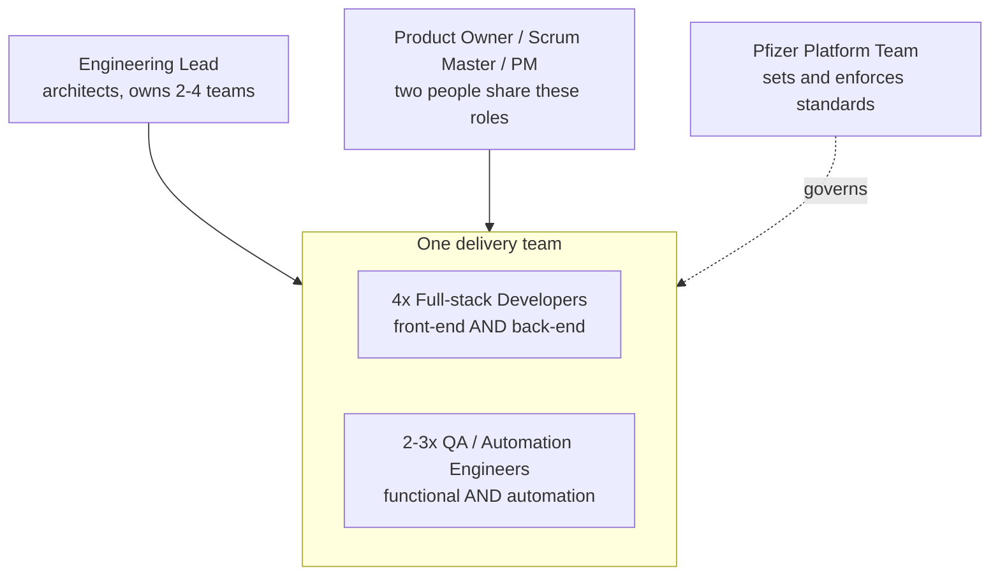
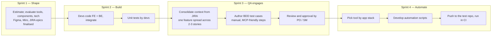
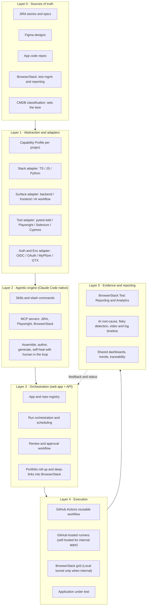
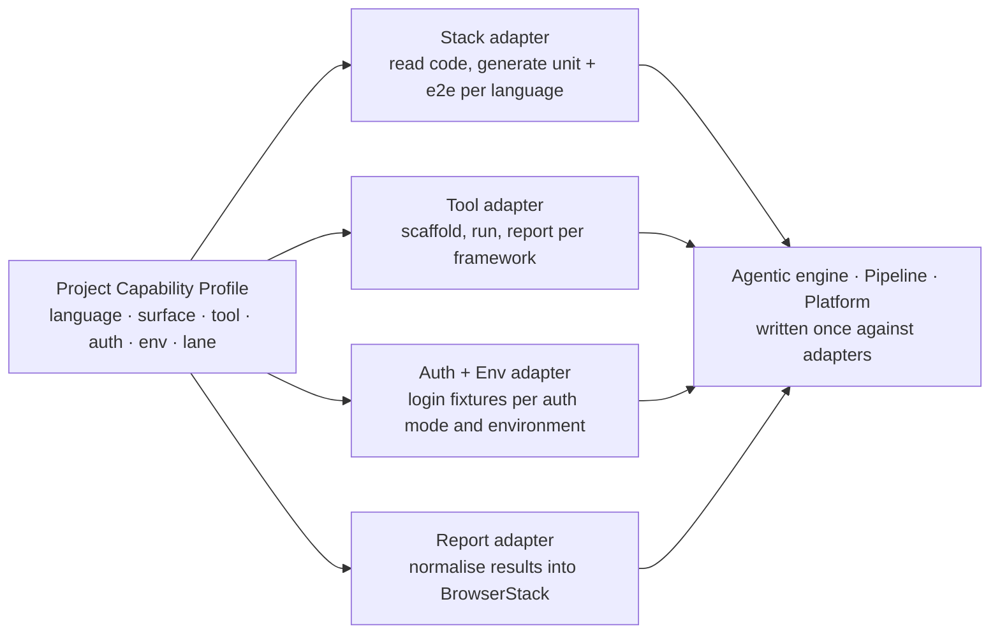
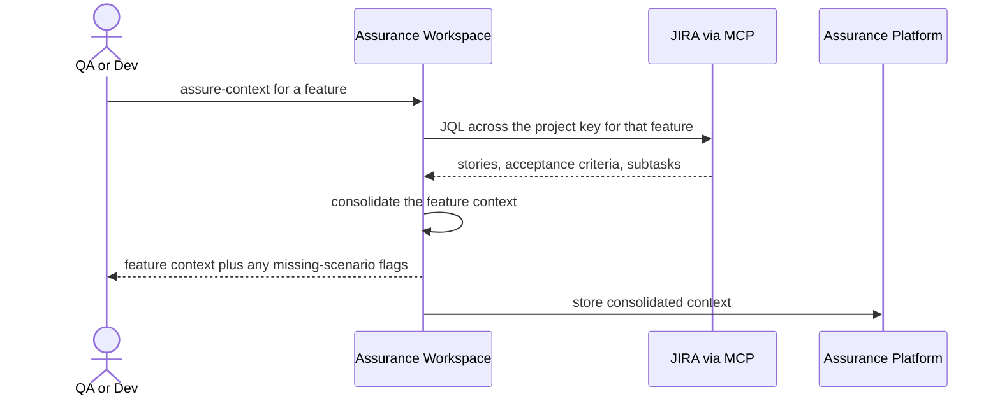
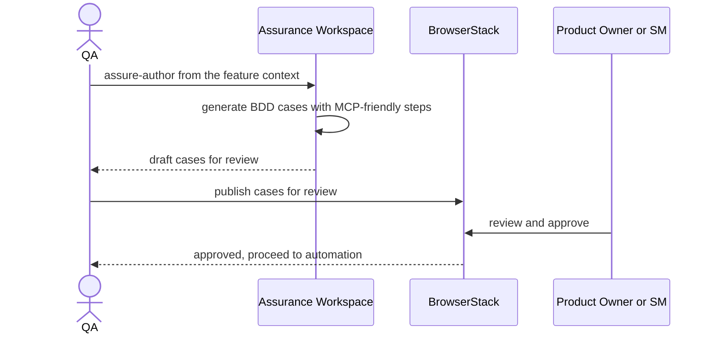
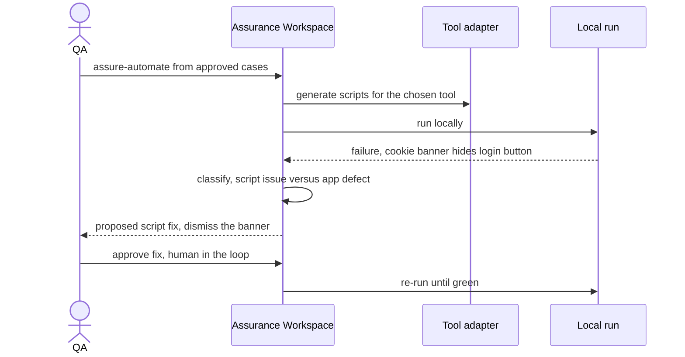
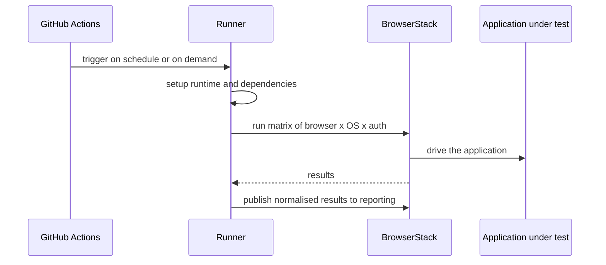
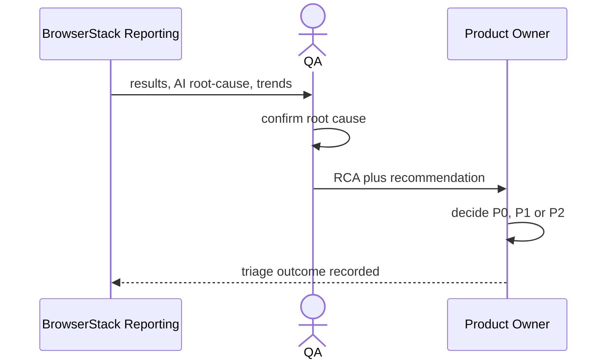
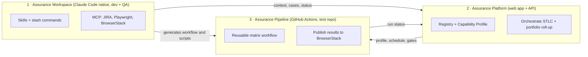

# Assurance Line — STLC Solution Blueprint (non-GxP / light-touch)

**Audience:** Newpage delivery team (builders) and Pfizer platform stakeholders.
**Scope:** the **non-GxP, light-touch** lane — the majority of teams using open-source tooling. The GxP (validated, commercial-tool) lane is acknowledged and deferred; nothing here blocks adding it later.

---

## 1. Reading the opportunity

The platform team owns testing standards for **applications built inside Pfizer** — not for SaaS tools. A typical target is an internal knowledge chatbot or an HCP web app such as **Pfizer Pro** (login, sample ordering, copay cards). We test *its* functional behaviour — login, registration, chat/response, configuration, integrations — end-to-end, predominantly through the UI journey, since that is where the functional scenarios surface.

Two principles shape the design:

- **Every team works differently.** Same org, different team, different flow — who owns the repo, when QA enters, which tool. The solution must **fit the team's reality** rather than impose one. This is why abstraction is a first-class requirement.
- **Non-GxP first.** It is the larger surface, it is simpler, and it uses tooling teams already have (Playwright, Selenium, Cypress, pytest-bdd, k6). GxP means commercial, locked-down tools (UFT, Tosca) and comes later.

### The two abstraction guarantees (the core design constraint)

Everything below honours two guarantees, enforced through a single **Capability Profile** per project plus a set of **adapters** (§6):

1. **Stack-agnostic** — works for **TS / JS / Python** apps, across **backend, frontend, and AI workflows**.
2. **Tool-agnostic** — the QA tool is the **team's choice** (pytest-bdd, Playwright, Selenium, Cypress, …). The platform never hardcodes a tool.

---

## 2. Business objectives

- **Consistent quality across the portfolio** — every in-scope app assured the same way, regardless of stack or tool, without forcing teams off the tools they already use.
- **Faster, AI-assisted STLC** — context-gathering, test-case authoring, automation, pipeline setup and self-healing accelerated by an agent, so QA capacity goes further.
- **Evidence that's easy to consume** — move from "download a zip from a GitHub run" to a shared, visual view of results, trends and root-cause that QA, PO, scrum master and managers can read directly.
- **A quality function that sits with the product** — treat QA as part of product design. The so-called non-functional requirements (page performance, button states) are really **cross-functional** — they decide whether the product works for the user at all. The platform should reinforce that posture.

---

## 3. Users & roles

A representative team for this client. The platform accommodates variation rather than assuming a single shape.



| User | What they do | What the platform gives them |
|---|---|---|
| **Full-stack developer** | Builds FE+BE; runs unit tests while building | Generate unit + component tests from a story and the code; surface missing scenarios |
| **QA / automation engineer** | Consolidates context, authors BDD cases, builds automation, owns the pipeline | The agentic workspace (§8.1): context assembly, authoring, tool-agnostic script generation, self-heal, pipeline generation |
| **Product Owner / Scrum Master** | Reviews/approves authored test cases; decides P0/P1/P2 from QA's RCA | Review-and-approve workflow; readable reporting with RCA, not raw zips |
| **Engineering lead** | Architects, owns several teams | Portfolio view across teams; consistent standards |
| **Platform team (client)** | Standards & enablement across many app teams | Governed self-service: one capability every team plugs into on their own terms |

---

## 4. How teams work today (current STLC), and where it hurts

Work moves sprint by sprint; QA engages once there is enough product to test.



The mechanics and the friction points the solution targets:

- **Context lives across multiple JIRA stories.** A single feature (e.g. login) is often split into a happy-path story, a validation-rules story and an edge-case story. QA consolidates these (via JQL on the project key) to reach full feature context. The agent assembles this and can quietly flag scenarios that no story specifies.
- **Authoring = creating test cases**, written in **BDD format** (Gherkin-style, manual — not scripts), phrased to be **automation/MCP-friendly** ("click login button") so they later map cleanly onto whichever runner the team uses, reducing automation effort. Authored mostly from the **UI / end-to-end** perspective.
- **Test cases are managed in BrowserStack** (the team is moving off TestRail). Treat BrowserStack as the test-management and reporting system of record.
- **Review/approval gate:** QA sends authored cases to PO/SM; approval unlocks the automation work.
- **Tool choice depends on stack:** PHP → Selenium; React → Playwright; JS → Cypress/Playwright. Teams may have home-grown frameworks. **The tool must remain the team's choice.**
- **A dedicated test repo** (e.g. `pfizerpro-tests`), separate from the app repo — the microservice/lightweight-repo mindset.
- **The test repo has four parts:** *utils*, *test cases* (feature files), *test-case implementation* (scripts, separate folder), *test data* — plus *fixtures* (session handling, setup/teardown, auth per mode).
- **Local loop:** scripts often fail for *script* reasons, not app reasons (classic: a cookie banner hides the login button) → the script is fixed → pushed.
- **CI:** the test repo runs a **GitHub Actions** workflow on schedule and on demand, across a **matrix of browser × OS × auth-mode** (OIDC, OAuth, MyPfizer, GTX, sandbox). Results today are uploaded as **pytest artifacts** (zips).
- **Reporting is painful today:** reading results means navigating to the repo → the run → artifacts → download → unzip → open HTML. POs and managers won't do this.
- **Pipeline generation is wanted:** the agent should generate the GitHub Actions workflow from the project's profile, not hand-written YAML.
- **Self-healing is wanted, with a human in the loop:** when a scheduled run breaks (e.g. a UI change), the agent proposes "heal or not?" rather than silently rewriting tests.
- **Triage:** QA produces an **RCA**; the **PO decides P0/P1/P2**. A UI test breaking on a seemingly cosmetic issue can still mean the functionality is broken.

---

## 5. The layered solution architecture

One capability, expressed as layers. Context flows **down** from the sources of truth through abstraction, the agent, orchestration and execution; evidence flows **back up** to the people who need it. Each layer is independent of the ones around it — which is what lets the tool and stack vary without the rest changing.



**What each layer owns**

- **Layer 0 — Sources of truth.** JIRA (requirements), Figma (design intent), the app code repos, BrowserStack (test management + reporting), and CMDB classification (which decides the lane). We integrate; we don't replace.
- **Layer 1 — Abstraction & adapters.** The most important layer here: a per-project **Capability Profile** plus adapters normalise stack, surface, tool and auth/env so everything above is written once and works everywhere (§6).
- **Layer 2 — Agentic engine (Claude Code native).** Skills, slash commands and MCP servers that do the work in the engineer's environment: assemble context, author BDD cases, generate tool-specific automation, self-heal, and generate the pipeline.
- **Layer 3 — Orchestration (web app + API).** Registers apps/repos, stores profiles, schedules and triggers runs, runs the review/approval workflow, and provides the portfolio roll-up across apps, deep-linking into BrowserStack for run detail.
- **Layer 4 — Execution.** The reusable GitHub Actions workflow, runners, the BrowserStack grid, and the application under test.
- **Layer 5 — Evidence & reporting.** BrowserStack Test Reporting & Analytics as the visual surface — build health, AI root-cause, flaky detection, video/log timeline, trends — shared with everyone who needs it.

---

## 6. The abstraction layer (how stack- and tool-agnostic actually works)

Each project declares a **Capability Profile** once. Everything above Layer 1 programs against **adapters**, never against a specific tool or language — so swapping Playwright for Selenium, or Python for TypeScript, is a profile change, not a rebuild.



**The Capability Profile** (illustrative, per project/repo):

- **Language:** TypeScript / JavaScript / Python
- **Surface:** backend (API/white-box) · frontend (UI/e2e) · AI workflow (eval-based)
- **QA tool:** pytest-bdd / Playwright / Selenium / Cypress / team framework
- **Auth modes:** OIDC, OAuth, MyPfizer, GTX, sandbox (the modes already in the matrix)
- **Environment:** the target environment and how it is reached
- **Lane:** non-GxP (this phase)

**The adapters** turn that profile into behaviour:

- **Stack adapter** — knows how to read code and generate the right kinds of test per language (unit + API for backend; component + e2e for frontend; eval harnesses for AI workflows).
- **Tool adapter** — a uniform contract — *scaffold a suite*, *run a tag/suite*, *emit results* — implemented per framework. BDD steps are authored to be MCP-friendly so they map onto whichever runner the team uses.
- **Auth + Env adapter** — encapsulates the login/session fixture per auth mode, and the network path to each environment, so the same test runs across the OIDC/OAuth/MyPfizer/GTX matrix. (For internal apps this is also where the proxy and BrowserStack Local tunnel live.)
- **Report adapter** — normalises every tool's output into BrowserStack, so reporting is tool-independent.

> **AI-workflow surface:** for apps where the AI *is* the feature (e.g. a chatbot's response accuracy), the surface adapter adds eval-style checks — golden questions, response-quality rubrics, "must cite source / must refuse out-of-scope / must not leak PII" — alongside the functional UI journey. Scored, not asserted.

---

## 7. Technical flows

### 7.1 Assemble context from JIRA



### 7.2 Author BDD test cases, then review & approve



### 7.3 Generate automation and self-heal locally (human in the loop)



### 7.4 CI pipeline run (matrix, BrowserStack, results)



### 7.5 Results, RCA and triage



---

## 8. The prototype — three components, in logical order

The light-touch lane is built as three components that snap together. Logical order: the engineer-side **Workspace** does the thinking and generation; it generates the **Pipeline** and feeds the **Platform**; the **Platform** orchestrates and surfaces evidence.



### 8.1 Assurance Workspace — Claude Code native (developers + QAs)

Lives in the engineer's editor/terminal. A set of **skills**, **slash commands** and **MCP servers** that operate against the Capability Profile and adapters. Illustrative commands:

- **assure-context** — pull and consolidate JIRA stories for a feature; flag scenarios no story specifies.
- **assure-author** — generate BDD test cases (manual, MCP-friendly), including the negative/edge scenarios the stories imply but don't state.
- **assure-automate** — generate automation for the *team's chosen tool* via the tool adapter (utils, implementation, fixtures, test data); honour session/fixture reuse.
- **assure-heal** — when a run breaks, classify *script issue vs app defect*, propose a fix, and wait for human approval before applying it.
- **assure-pipeline** — generate the GitHub Actions workflow for the test repo from the profile (matrix, runner, BrowserStack, publish-back) — so QAs don't hand-write YAML.
- **assure-unit** (developers) — from a story plus the code, generate unit/component tests and surface missing scenarios.

The light-touch work is fast, local, iterative and tool-varied — exactly where an agent in the engineer's loop is strongest.

### 8.2 Assurance Platform — web application + API

The control plane and the portfolio-level pane of glass. Responsibilities:

- **Registry & Capability Profile** — register apps/repos and their profile (stack, surface, tool, auth, env, lane).
- **Orchestration & scheduling** — trigger and schedule runs; hold run history per app.
- **Review & gating** — the authored-cases review/approval workflow.
- **Portfolio roll-up** — status, pass-rate and trends across apps, deep-linking into BrowserStack for run-level detail rather than re-implementing it.

Run-level reporting (results, AI root-cause, flaky detection, video/log timeline, shareable dashboards) is owned by **BrowserStack Test Reporting & Analytics** — consumed by QA, PO, SM and managers via a shared link. The pytest runs feed it via the BrowserStack SDK or by uploading JUnit XML to its API, so even runs outside BrowserStack infrastructure appear there. This directly replaces today's "download-a-zip" reporting.

### 8.3 Assurance Pipeline — reusable GitHub Actions workflow (the test repo)

A reusable/composite workflow in the separate `…-tests` repo, parameterised by the profile. Stages:

1. Set up the language runtime and dependencies
2. Configure BrowserStack
3. Check out the test repo · set run-time env (e.g. `IS_MOBILE` for Android/iOS)
4. **Run** the suite via the tool adapter's run command, across the **browser × OS × auth** matrix
5. **Publish normalised results** into BrowserStack reporting

**Runner & network recommendation.** For the prototype against **Pfizer Pro (a public site)**: **GitHub-hosted runners + BrowserStack cloud**, with **no** self-hosted runner, proxy or BrowserStack Local tunnel. Those are only needed for *internal* Pfizer applications later — at which point self-hosted runners + BrowserStack Local + proxy apply (the existing matrix pattern), absorbed by the Auth/Env adapter so the rest of the design is unchanged.

**Test repo structure** (illustrative — the four parts plus fixtures, tool-agnostic):

```text
pfizerpro-tests/
├─ .github/workflows/     # the generated reusable Assurance Pipeline
├─ tests/                  # test cases (feature files / specs)
├─ steps/                  # test-case implementation (scripts: .py or .ts)
├─ fixtures/               # session handling, setup/teardown, auth per mode
├─ utils/                  # shared helpers
├─ data/                   # test data
└─ assurance.profile       # the Capability Profile for this repo
```

---

## 9. Cross-cutting concerns

- **Other test types**, slotted on the right cadence via adapters rather than all per-run: performance (k6/Locust), accessibility (axe), security (SAST/secrets), API/white-box (boundary-value and other ISTQB techniques).
- **PII / secure data handling — good-to-have for this phase.** Where it adds value: synthetic/masked test data, secrets via the runner's secret store. It becomes a hard requirement for internal apps and the GxP lane later.
- **GxP lane — out of scope for the prototype.** Commercial, locked-down tools, validation evidence and sign-off. The plan: ship non-GxP, learn the GxP context over a release cycle, then extend the same layered model with human-gated, evidence-first behaviour. The lane is assumed CMDB-driven; we don't act on it now.

---

## 10. Phase 1 scope & sequencing

| In scope (Phase 1) | Out of scope (later) |
|---|---|
| Non-GxP / light-touch lane | GxP / validated lane |
| Pfizer Pro (public) as the target app | Internal apps needing tunnel/proxy/self-hosted runners |
| Workspace + Platform + Pipeline (the three components) | Full non-functional gate set (perf/security/a11y as add-ons) |
| Playwright + pytest-bdd adapters first | Selenium / Cypress adapters next |
| BrowserStack reporting as the surface | Custom run-level dashboards |

Build order follows §8: stand up the Workspace commands on Pfizer Pro, generate the Pipeline from the profile, and feed the Platform; prove the abstraction early by adding a second tool adapter once the contracts are fixed.

### To confirm with the client

- **Auth-mode catalogue** — the full list of auth modes and how the login fixture differs per mode (the one genuine unknown for the Auth/Env adapter).
- **BrowserStack reporting access** — SDK vs JUnit-XML upload, and shared-dashboard access for PO/SM/managers.
- **Sample-app sign-in** — the dummy login approach for Pfizer Pro in the prototype.

---

*Prepared by Newpage — AI Center of Excellence. Working draft for internal alignment and client discussion.*
