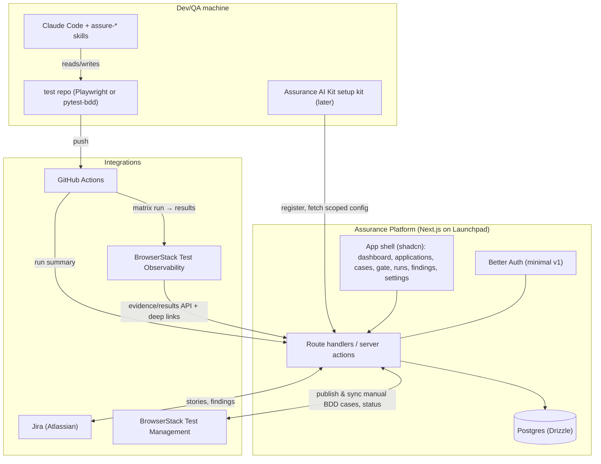

# Assurance Platform — Product Design Doc (v0.2, draft for review)

**Status:** Draft for direction-setting · **Date:** 2026-06-30
**Companion to:** [demo-plan.md](demo-plan.md) (the proven prototype), [stlc-assurance-blueprint.md](stlc-assurance-blueprint.md) (methodology), [session-handoff.md](session-handoff.md) (current state).

> **Purpose.** We have a working **prototype** that proves the STLC "Assurance Line" concept end-to-end
> (real Jira board, two test adapters from one Gherkin set, self-heal, CI matrix → BrowserStack, a
> static dashboard). This doc plans the **product**: the **Assurance Platform** — a real, persistent,
> multi-user, modern web app that is the control plane (the "Delivery & Quality" surface) of the
> Assurance Line. A separate **local setup kit, "Assurance AI Kit"** (`assurance-ai-kit`), gets any dev/QA
> machine productive in minutes; it is a **later milestone**, not part of the platform MVP.

> **Positioning (client context).** Pfizer's "Assurance Line" (a line within the **METRO** platform) is
> a full SDLC journey with **two orchestrators** — a *Solution Intelligence* orchestrator (CMDB · risk ·
> classification · supplier — "profiles once, decides everything") and a *Delivery & Quality*
> orchestrator (JIRA · the STLC crew · gates · **STLC deliverables**: test cases, scripts, traceability).
> **Our Assurance Platform is the Delivery & Quality surface + the STLC-deliverables gate**, scoped to
> **non-GxP first** (the ~80% lightweight, open-source-tool segment). The upstream Solution Intelligence
> orchestrator (and GxP) is out of scope for now; we position alongside it, not in conflict with it.
> *(Open: confirm what the existing "Lumi" and "Hydra" agents already cover so we don't duplicate.)*

## 0. Decisions locked (2026-06-30)

1. **Sequencing: design-first.** Refine wireframes → clickable Next.js UI shell (Launchpad + shadcn,
   mock data) → then wire persistence.
2. **v1 scope: the Assurance Platform (control-plane portal) only.** The **Assurance AI Kit** local setup kit
   is a milestone **after** the platform's phase-1 MVP (see §4) — not in v1.
3. **Naming (corrected 2026-06-30).** The **product/portal = "Assurance Platform."** **"Assurance AI Kit" is
   the local setup kit** — the thing that installs everything a machine needs to get started (Claude Code,
   the `assure-*` skills, MCP config, tools/Playwright, docs/automation) and scaffolds the test repo. AAK
   ≠ the platform; AAK is built after platform phase-1. Supersedes the earlier "Assurance AI Kit = the portal."
4. **Docs:** keep this hand-authored design doc **and a PRD** ([assurance-platform-prd.md](assurance-platform-prd.md)). (ARC workflow not used for now.)
5. **Hosting: local Docker for the demo.** Everything runs via `docker compose` (Next.js app +
   Postgres) on a laptop — **no cloud hosting for now**; Cloudflare/managed-Postgres deploy is deferred.
6. **Auth: minimal.** Use Better Auth's built-in login (ships in the starter) for identity on the
   approval stamp + a seeded user or two. **Defer granular RBAC** (role management/enforcement) to a
   later phase — include only if cheap and demo-valuable.
7. **Terminology: "Application" + "Feature".** See §2a. An **Application** is the product
   (e.g. *PfizerForAll*); a **Feature** is an epic/slice under assurance (e.g. *Medication Savings
   Finder* = a Jira Epic). The earlier "App"/"Project" naming is superseded.
8. **Test Management in the MVP (new 2026-06-30).** Authored manual BDD cases are **published to and
   reflected from BrowserStack Test Management** — the home of the *approved* cases and traceability, and
   what the PO/SM actually reviews (matches the real Pfizer flow). The `.feature`/automation lives in the
   test repo. The approval gate operates on the Test Management cases.
9. **Auth modes deferred (new 2026-06-30).** Real enterprise auth (OIDC / OAuth / MyPfizer / GTX),
   **BrowserStack Local tunnels for private lower-environments**, and **mobile (Android/iOS)** are *not*
   in phase-1 MVP. They travel together as a later "matrix dimensions" expansion; the MVP keeps the
   public-site, browser × OS model.
10. **Authoring rigor (new 2026-06-30).** Authored cases apply formal **ISTQB test-design techniques**
    (boundary-value analysis, equivalence partitioning, decision tables; white-box rules for API later) —
    this is the "generated to your rigour" promise. Findings carry an **AI-drafted root-cause analysis
    (RCA)**; the PO sets priority (P0/P1/P2).

---

## 1. From prototype → product (the gap)

| Dimension | Prototype today | Product target |
|---|---|---|
| Dashboard | Static Vite SPA reading local JSON | Next.js app, **DB-persisted**, multi-project, multi-user |
| Data | Hand-seeded JSON files | Postgres (Drizzle) + live ingestion from CI / BrowserStack / Jira |
| Auth | None | Better Auth (org SSO-ready), teams + **RBAC** (QA / Approver / Admin) |
| Onboarding | Manual local setup | **Assurance AI Kit** one-command setup kit (later milestone) |
| Skills | Local `.claude/skills` in one repo | Versioned, distributable **skills bundle** the kit installs |
| Look & feel | Clean but bespoke CSS | **shadcn**, app shell with sidebar/menu, theming, polished |
| Scope | One app (Savings Finder) | A **portfolio** control plane across many apps/teams |

**Recommendation:** build the product on the org's **Launchpad Next.js starter** (already in
`launchpad-frontend-nextjs-main`). It ships precisely the foundation we need (see §3), so we spend our
time on the Assurance domain, not plumbing.

---

## 2. Personas & the end-to-end flow

**Personas**
- **QA Engineer** — onboards a project, runs the `/assure-*` workflow, reviews evidence, triages flaky/findings.
- **Product Owner / Approver** — reviews authored BDD cases, approves the gate (unlocks automation).
- **Eng/Platform Admin** — manages integrations (Jira/GitHub/BrowserStack), teams, RBAC, kit versions.
- **Stakeholder/Viewer** — reads the portfolio roll-up + evidence; no edit rights.

**The golden path (a QA validating a feature)**
```
1. Sign in to the Assurance Platform.
2. (Once per app) Set up assurance → choose ONE E2E framework; matrix (browser × OS); environment + lane;
   create the test repo. Persists the Application's capability profile.
3. (Per machine, later milestone) Assurance AI Kit setup kit installs Claude Code + the assure-* skills + MCP
   config + tools/Playwright and scaffolds/links the test repo — single-use token from the platform.
4. In the repo, the QA validates a dev-complete feature with the Assurance Line:
   /assure-context → /assure-author (ISTQB-rigorous BDD cases, published to BrowserStack Test Management)
   → (PO approves the gate on the Test-Management cases) → /assure-automate → /assure-heal →
   /assure-pipeline → push.
5. CI runs the matrix on free runners; results + video/trace publish to BrowserStack Observability AND
   a run summary is read back by the platform.
6. The Assurance Platform updates live: test cases (↔ Test Management), run history, evidence deep-links,
   findings (with AI-drafted RCA) / flaky, portfolio roll-up, approvals — all persisted, all shared.
```

---

## 2a. Domain model & terminology

The unit names matter (this corrects the earlier "App"/"Project" usage):

- **Application** — the product under test, e.g. **PfizerForAll**. It owns the **integrations**
  (one Jira project, one GitHub repo, one **BrowserStack project — Test Management *and* Observability**),
  its **environment(s)**, and a **default capability profile**. The portfolio rolls up at this level.
- **Feature** *(the unit a QA actually onboards & works on)* — an epic/slice under assurance, e.g.
  **Medication Savings Finder**. It maps to a **Jira Epic**, and owns its **suites → scenarios**, its
  **approval gate**, and its **findings**. CI **runs** are at the Application level (one repo/pipeline)
  but **attributed to Features** via scenario tags.
- **Suite → Scenario** — the authored cases. One artifact, two homes: the **manual BDD cases live in
  BrowserStack Test Management** (the reviewed/approved record + traceability) and the matching
  **Gherkin `.feature`/automation lives in the test repo**. The platform keeps them in sync.
- **Run → JobResult** — a CI run and its matrix cells (adapter × browser × OS) with evidence.

```
Application (PfizerForAll)
 ├─ integrations: Jira project · GitHub repo · BrowserStack (Test Management + Observability)
 ├─ environment(s) · default capability profile
 └─ Feature (Medication Savings Finder = Jira Epic)
      ├─ capability profile (tool choice, matrix) — defaults from the Application
      ├─ Suites → Scenarios   (manual BDD cases ↔ Test Management · .feature ↔ test repo)
      ├─ Approval gate (on the Test-Management cases) · Findings (with RCA)
      └─ Runs (attributed via tags)
```

> Nav consequence: the sidebar item is **Applications** (not "Apps"); drilling in shows its
> **Features**; a Feature carries Test Cases / Approvals / Runs / Findings / Flaky.

## 2b. The QA workflow — set up once per app, then validate features

Assurance is configured **per Application, once** — not per feature. There is **one test repo per
app** (`pfizerforall-tests`), with feature tests organised inside it (per-feature folders/tags), one
CI pipeline, one BrowserStack project. Choosing a framework/matrix/repo every feature would be
needless repetition.

**Set up assurance (per Application, once):**

1. **Choose your E2E framework — pick ONE.** Author behaviour once in Gherkin; we generate that
   framework's suite. **Playwright (TS)** *or* **pytest-bdd (Py)** today; Cypress/Selenium roadmap.
   You can **switch later** — a profile change, not a rewrite. (We do **not** run two E2E frameworks
   over the same journeys — that's duplicate coverage.)
   - **Test types** (extensibility, separate from the E2E framework): **E2E** now; **API**,
     **Performance** (k6/Locust), **Accessibility** added later as their *own* adapters. This is the
     real reason to have multiple tools — different modalities, not two E2E tools.
2. **Matrix & environment** — browsers × OS; the deployed environment (e.g. Staging); **lane** (GxP /
   non-GxP). *(Auth modes, BrowserStack Local tunnels for private environments, and mobile are a later
   "matrix dimensions" expansion — see §0.9 — not in phase-1 MVP.)*
3. **Test repo** — create the **one** test repo for the app (scaffolded with the framework's suite +
   skills + CI matrix). *(Use-an-existing-repo is a later option.)*
4. **Review → Create** — persists the Application's **capability profile** (`assurance.profile`) and
   creates the repo.

**Validate a feature (per feature, repeated — the ongoing QA work):**

- Pick a **dev-complete** feature (a Jira epic) → it **inherits the app's profile** (no tool re-pick) →
  `/assure-context → author → (PO approves) → automate → heal → run`. Authoring applies **ISTQB
  test-design techniques** (boundary-value analysis, equivalence partitioning, decision tables) and
  **publishes the manual BDD cases to BrowserStack Test Management**; the PO approves the gate **on those
  cases**. The matching `.feature`/automation lands in the shared repo, tagged to that feature; evidence +
  status (and any finding's **RCA**) roll up in the platform.

> **Advanced (later):** per-feature overrides (a feature needs a different matrix, or an extra test
> type) layer on top of the app profile — but the default is "set up once, validate many."

### Three distinct flows (don't conflate)

- **Connect an Application** — once, by a **lead/admin**, before QAs arrive: name + connect the app's
  GitHub repo, Jira project, environment(s) (+ BrowserStack). *Creates the project.*
- **Set up assurance** — once per app, by a **QA/lead**: choose framework + matrix + create the test repo.
- **Validate a feature** — repeated, by a **QA**, per dev-complete feature (inherits the app profile).

### Data provenance (what's known, and from where)

- **Feature list** = **Jira epics** of the connected project (`issuetype = Epic`). Features are not
  hand-entered — they sync from Jira.
- **Dev status** (Done / In development) = computed from the **epic + child-story statuses** in Jira.
- **Sprint(s)** = from the stories' Jira sprint field; the board's **active sprint** is shown as context
  (we do **not** track "the sprint a user joined" — that isn't knowable).
- **Assurance status** (not set up / validating / passing) = from the **Assurance Platform's own** records.
- **Deployment** (is the feature live on an environment?) = **not in Jira**. v1: the QA **confirms** the
  environment in the wizard. Later: auto-detect via the deploy pipeline (GitHub Deployments / releases /
  env health). Only dev-complete **and** deployed features are selectable for assurance.
- *(Default Feature = Jira Epic; mapping to a label/component is a later option.)*

---

## 3. What the Launchpad starter already gives us (foundation)

From `launchpad-frontend-nextjs-main` (`copier.yml`, `package.json.jinja`, `AGENTS.md`):

- **Next.js 16 (App Router) + React 19 + TypeScript**, Tailwind 4, **shadcn 4**, Lucide, next-themes, sonner, nuqs, zod.
- **App shell already present:** `app-sidebar`, `nav-main`, `nav-projects`, `nav-user`, `team-switcher`, theme toggle, route groups `(auth)` / `(protected)` / `(modules)`.
- **Drizzle ORM** (Postgres *or* SQLite) with schema/queries/migrations + a `tasks` CRUD example.
- **Better Auth** (cookie/JWT, email verification, Drizzle adapter) + protected/auth route groups + `useAuth`.
- **LLM module** (OpenRouter via Vercel AI SDK) — ready for in-app AI assist/chat.
- **OpenAPI typed client** option (openapi-fetch + react-query) if we want a separate backend service.
- **Cloudflare Workers deploy** via OpenNext (`opennextjs-cloudflare`), or SPA static export to Pages.
- **Quality:** Biome, Vitest, Playwright, Docker, copier template, agent-ready (`.claude`, `.agents`, `AGENTS.md`, `launchpad` script).

→ For the platform we'd scaffold with: **Drizzle + Postgres**, **Better Auth**, **LLM module on**, OpenNext deploy.

---

## 4. "Assurance AI Kit" — the local setup kit (later milestone)

**This is what "Assurance AI Kit" refers to** — the local onboarding kit, **not** the platform. It is built
**after** the Assurance Platform's phase-1 MVP. Goal: **minutes-to-first-test**, zero tribal setup —
install everything a dev/QA machine needs to feed the platform.

**Surface:** an **Onboard** page on the Assurance Platform with a copy-paste command and a live checklist
that turns green as the kit reports progress.

**What the installer does (idempotent, `--dry-run` supported):**
1. **Preflight/doctor** — detect/verify Node 20+, Python 3.11+, pnpm, git, Claude Code; offer to install missing.
2. **Install Playwright browsers** (chromium/firefox/webkit).
3. **Install the `assure-*` skills bundle** into the user's Claude Code (versioned; `skills-lock.json` style).
4. **Write MCP config** for Atlassian, BrowserStack, Context7 (endpoints; auth via the user's own login/token, never baked in).
5. **Scaffold the test repo** from a copier/degit template (mirrors `pfizerforall-tests`: features/steps/utils/data, CI workflow, browserstack.yml).
6. **Register with the platform** — exchanges the **short-lived onboarding token** for scoped, non-secret
   project config (project id, capability profile, repo/Jira/BS references). Secrets (BrowserStack key,
   Jira token) are entered locally into `.env` / a secrets manager — the script never transports them.
7. **Verify** — runs a doctor + smoke test; reports status back so the platform shows "✓ connected".

**Delivery options (decide in §11):**
- `curl … | bash` one-liner (fastest), and/or a downloadable signed `assurance-ai-kit.sh`, and/or a small
  cross-platform CLI (`aak`) distributed via npm/pipx/homebrew for richer UX (`aak init/doctor/run/login`).

**Security model:** onboarding token is **single-use, short-TTL, project-scoped**; the script is
**version-pinned + checksum/signature-verified**; no long-lived secrets in the script or platform logs;
least-privilege scopes for each integration.

---

## 5. System architecture



> **Architecture correction (2026-07-05) — see [assurance-architecture.md](assurance-architecture.md), now
> authoritative.** The diagram above shows the platform calling Jira/BrowserStack directly; that is
> **superseded**. The platform holds **no vendor API clients** and never calls Jira/GitHub/BrowserStack.
> Those systems are reached **only** by the **Assurance Engine** (the portable plugin/MCP, run in Claude
> Code/Cursor/CI) using the **user's own MCP creds or the repo's CI secrets**. The engine **pushes** events
> to the platform (features, cases, runs, findings); the platform's only outbound call is a **read of its own
> gate state**. "Connect Application" is therefore **metadata registration only** (no credentials/OAuth);
> the first real Jira read + feature-sync happens when the engine runs at **Set up Assurance** (in Claude
> Code). The engine is **host-agnostic** (Claude Code · Desktop · Cursor · Copilot · CI GitHub Action) and
> **framework-agnostic** (Playwright/pytest-bdd/Selenium/… via adapters) — two abstraction axes, one
> governance plane.

**Notes**
- v1 backend = **Next.js route handlers + Drizzle** (no separate service). If orchestration grows
  (schedulers, heavy sync), add a worker/queue (Cloudflare Queues/DO — skills available) later.
- Ingestion (per the correction above): the engine/CI **pushes** a signed run/case/feature summary to the
  platform API; the platform does **not** poll vendors. BrowserStack **Observability** evidence is reached
  via deep-links the engine includes in its push; **Test Management** case status is written by the
  **engine** (its own creds), not the platform.

---

## 6. Information architecture (navigation)

```
Assurance Platform
├─ Dashboard            Portfolio roll-up (across Applications), health, recent runs, attention
├─ Applications        List → Application detail → its Features:
│    └─ Feature detail:
│         ├─ Overview     Capability profile, status, quick links
│         ├─ Test Cases   Authored BDD cases (per story) ↔ BrowserStack Test Management, review state
│         ├─ Approvals    Review & approve gate (on the Test-Management cases) + history
│         ├─ Runs         Run history + matrix cells + evidence (video/trace/Observability)
│         ├─ Findings     Bugs + observations (Jira-linked), AI-drafted RCA, triage
│         └─ Flaky        Flaky register (pass-rate, classification, quarantine)
├─ Skills              The assure-* catalog + versions (what the Assurance AI Kit installs)
├─ Integrations        Jira / GitHub / BrowserStack (Test Management + Observability), per Application
├─ Team                Members & roles  (minimal in v1; RBAC later)
└─ Settings            Profile, theme, tokens, audit log
(Onboard — the Assurance AI Kit setup-kit page — is added with the kit milestone, after platform phase-1.)
```

---

## 7. Key screens (wireframe level)

**Dashboard**
```
┌ Assurance Platform ──────────────────────────────── [● dark] [user ▾] ┐
│ Portfolio health     ▮▮▮▮▯ 92% pass   3 apps   2 open findings            │
│ ┌ Savings Finder ┐ ┌ Newsletter ┐ ┌ + Onboard app ┐                       │
│ │ 100% · 1 bug   │ │ onboarding │ │               │                       │
│ Recent runs ───────────────────────────────────────  Attention ───────── │
│ ✓ #28361 resilience … 8/8   ✓ #28356 … 8/8   ✗ #28356 …    SAA-16 Firefox │
└───────────────────────────────────────────────────────────────────────────┘
```

**Onboard (the Assurance AI Kit setup kit — later milestone)**
```
Onboard a machine ▸ Install the Assurance AI Kit
  $ curl -fsSL https://platform/aak/install | bash -s -- --token=•••••   [copy]
  Prerequisites:  ◐ Claude Code ◐ Node ◐ Python ◐ Playwright ◐ Skills ◐ MCP ◐ Repo
  Status: waiting for first check-in…   (turns ✓ live as the kit reports)
```

**Approvals (gate)** — productized version of today's static gate: per-case rows (sourced from
BrowserStack Test Management), approve as PO, persisted + identity-stamped history, status written back
to Test Management, deep-link to Jira + Test Management.

**Runs → run detail** — matrix cells (browser×os×adapter) with pass/fail, duration, and **inline
evidence** (BrowserStack video/trace deep-links + Playwright trace artifact).

**Findings → finding detail** — bug/observation with severity, classification (product-bug vs flaky-test),
an **AI-drafted root-cause analysis (RCA)** the QA edits, and a PO-set priority (P0/P1/P2); Jira-linked.

---

## 8. Data model (initial)

```
organization(id, name)
user(id, org_id, email, name, role[admin|qa|approver|viewer])
application(id, org_id, name, lane, jira_project_key, github_repo, bs_tm_project, bs_o11y_project, created_by)
feature(id, application_id, jira_epic_key, title, dev_status, assurance_status, active_sprint, deployed bool)
integration(id, org_id, application_id?, kind[jira|github|browserstack_tm|browserstack_o11y], config_json, secret_ref)
capability_profile(id, application_id, framework, test_types[], matrix_json, env_json)  -- auth_modes deferred
suite(id, feature_id, key, title, jira_story, status, tm_suite_id, tm_synced_at)
scenario(id, suite_id, name, gherkin, tags[], proposed bool, tm_case_id, technique[bva|equivalence|decision-table|...])
approval(id, feature_id, suite_id?, status, approver_id, approved_at, note, tm_status_pushed bool)
run(id, application_id, feature_id?, ci_run_id, trigger, commit, status, started_at, finished_at, actions_url, o11y_build)
job_result(id, run_id, adapter, browser, os, status, duration_ms, video_url, trace_url)
finding(id, feature_id, type[bug|observation], severity, priority[p0|p1|p2], title, classification, status, rca_text, jira_key, run_id?, scenario_id?)
flaky_record(id, feature_id, test_id, pass_rate, classification[test|product], quarantined bool, ticket)
onboarding_token(id, application_id, created_by, expires_at, used_at, scope_json)   -- Assurance AI Kit milestone
kit_install(id, application_id, machine, kit_version, status, last_checkin_at)      -- Assurance AI Kit milestone
audit_log(id, org_id, actor_id, action, target, at)
```

---

## 9. Tech choices (mapped to Launchpad options)

| Concern | Choice |
|---|---|
| App framework | Next.js 16 (App Router) + React 19 — Launchpad |
| UI | shadcn 4 + Tailwind 4 + Lucide + next-themes (sidebar shell already present) |
| DB / ORM | **Postgres + Drizzle** (`include_drizzle`, `db_type=pg`) |
| Auth | **Better Auth** + RBAC (`include_better_auth`) |
| In-app AI | **LLM module** (OpenRouter / Vercel AI SDK) for assist/explain/triage |
| API | Next.js route handlers + server actions (v1); OpenAPI client option if a separate service emerges |
| Deploy | **Local Docker** (`docker compose`: Next.js + Postgres) for the demo; Cloudflare/OpenNext deferred |
| Test Management | **BrowserStack Test Management** (publish + sync manual BDD cases, approval status) |
| Quality | Biome, Vitest, Playwright (dog-food our own Assurance Line on the platform) |
| Assurance AI Kit (later) | `curl … | bash` setup kit; copier/degit test-repo template; no `aak` CLI for now |

---

## 10. Build phases (proposed)

Phase-1 MVP = the Assurance Platform (P0–P2, P4–P5). The **Assurance AI Kit** setup kit (P3) comes **after**.

- **P0 — Design-first (current):** refine IA + wireframes + the clickable mockup for all key screens.
- **P1 — App shell + auth:** scaffold from Launchpad (Drizzle/pg, Better Auth — minimal, LLM); sidebar nav, theme, seeded users.
- **P2 — Control plane (DB):** DB-backed pages — applications/features, profile, **test cases (↔ BrowserStack Test Management)**,
  approvals, runs, findings (with RCA), flaky, portfolio. Migrate the prototype's JSON into seed data.
- **P4 — Ingestion:** GitHub run summaries (Actions API/posted summary), BrowserStack Observability results, **Test Management sync**, Jira sync; evidence deep-links.
- **P5 — Skills catalog:** versioned `assure-*` bundle + Skills catalog page.
- **P6 — Harden & package:** audit log, secrets handling, dog-food E2E, **`docker compose` one-command local run**.
- **P3 — Assurance AI Kit (after phase-1):** the `curl … | bash` setup kit + onboarding-token API + test-repo template + Onboard page with live status.

### Roadmap (phase 2/3, out of MVP)
- **Visual / design-conformance testing** (see §13).
- **Matrix dimensions:** auth modes (OIDC/OAuth/MyPfizer/GTX), BrowserStack Local tunnel for private lower-environments, mobile (Android/iOS).
- **GxP lane** and the upstream **Solution Intelligence orchestrator** (CMDB / risk / classification / supplier).
- **Jira-status-driven trigger** (epic/story → *Ready for QA* kicks off assurance).
- RBAC enforcement; cloud deploy (Cloudflare/OpenNext).

---

## 11. Open decisions (need your input)

1. **Positioning** — confirm what existing **Lumi / Hydra** agents cover so the platform doesn't duplicate the Solution Intelligence side.
2. **Test Management write-back** — on approve, write status back to BrowserStack Test Management (recommended default: yes), or deep-link only?
3. **Jira write-back** — create/update finding bugs from the platform, or deep-link only, in v1?
4. **Auth** — Better Auth standalone, or wire to org SSO (Microsoft 365 / OIDC) — later.
5. **Where it lives** — new repo (e.g. `assurance-platform`) generated from Launchpad, kept beside the prototype.
6. ~~Hosting/DB~~ — **Resolved:** local Docker for the demo; cloud deploy deferred.
7. ~~v1 scope / installer~~ — **Resolved:** platform first; Assurance AI Kit setup kit after phase-1.

---

## 12. Recommendation

Go **design-first**: refine wireframes + the clickable mockup for every key screen, then stand up a
**clickable Next.js UI shell** (Launchpad + shadcn, mock data, no backend) so you can feel the product
before we wire persistence. In parallel we lock the data model + integration contracts (incl. Test
Management) here. Then P1→P6, with the Assurance AI Kit setup kit after phase-1. The existing prototype stays
as the **reference implementation** the platform productizes.

---

## 13. Visual / design-conformance testing (phase 2/3 — approach)

Bharath repeatedly asked for "read the Figma, match it against what's built, show the defects." This is a
distinct **test type** (not E2E), so it slots into the existing "test types" extensibility — its own adapter:

- **Inputs:** the Figma frame(s) for a feature (via the Figma MCP / export) as the expected design; the
  deployed page as the actual.
- **Two complementary modes:**
  1. **Pixel/region visual regression** — Playwright `toHaveScreenshot()` baselines per matrix cell;
     catches unintended visual drift run-over-run. Cheap, deterministic, available today.
  2. **Design-conformance (Figma ↔ live)** — compare live DOM/computed styles + screenshot against the
     Figma frame; an **LLM-assisted diff** surfaces semantic mismatches (missing section, wrong copy,
     spacing/colour off) as **observations**, not hard failures. This is the "show me the defects vs the
     design" Bharath wants.
- **Where it lands:** a `/assure-visual` skill produces a baseline + a conformance report; results show as
  a **Visual** tab on the feature with side-by-side evidence; mismatches become **findings (observations)**.
- **Sequencing:** phase 2 = visual regression baselines; phase 3 = Figma-conformance diffing. Out of MVP.
